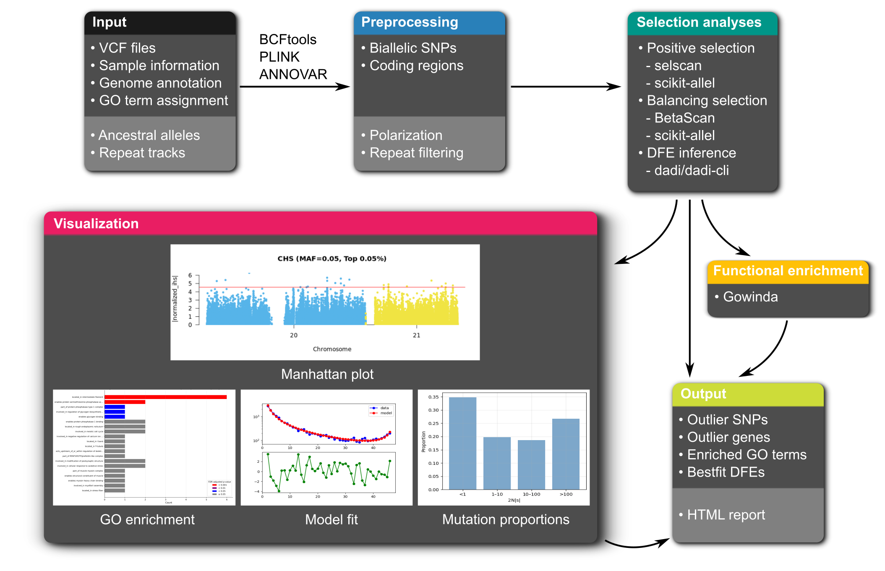

# selscape

`selscape` is a [Snakemake](https://snakemake.readthedocs.io/en/stable/) workflow for studying genomic landscapes of natural selection across species. It integrates [BCFtools](https://github.com/samtools/bcftools) and [PLINK](https://www.cog-genomics.org/plink/) for variant processing and filtering, and runs selection scans with [BetaScan](https://github.com/ksiewert/BetaScan), [selscan](https://github.com/szpiech/selscan), and [scikit-allel](https://github.com/cggh/scikit-allel) to identify outlier regions across multiple statistics. It also uses [dadi](https://dadi.readthedocs.io/en/latest/) via [dadi-cli](https://github.com/xin-huang/dadi-cli) to infer the distribution of fitness effects (DFE). Outlier regions are functionally annotated with [ANNOVAR](https://annovar.openbioinformatics.org/en/latest/) and assessed for Gene Ontology (GO) term enrichment using [Gowinda](https://sourceforge.net/projects/gowinda/).



## Requirements

`selscape` works on Linux operating systems with the following dependencies:

  - bcftools=1.21
  - bedtools=2.31.1
  - cyvcf2=0.31.0
  - dadi=2.4.3
  - dadi-cli=0.9.13
  - matplotlib=3.9.4
  - nlopt=2.10.0
  - numpy=1.26.4
  - openjdk=25.0.1
  - pandas=2.2.3
  - pip=25.0.1
  - plink=1.90b6.21
  - pyliftover=0.4.1
  - pydantic=2.5.0
  - pysam=0.23.0
  - python=3.11.13
  - r-base=4.4.3
  - r-data.table=1.17.8
  - r-dt=0.33
  - r-ggplot2=3.5.2
  - r-htmlwidgets=1.6.4
  - r-qqman=0.1.9
  - r-readr=2.1.5
  - scikit-allel=1.3.7
  - scipy=1.13.1
  - snakemake=7.32.4


## Installation

Users can first install [mamba](https://mamba.readthedocs.io/en/latest/installation/mamba-installation.html), and then install `selscape` using the following commands:

```
git clone https://github.com/xin-huang/selscape
cd selscape
mamba env create -f workflow/envs/env.yaml
mamba activate selscape-test
```

In addition, users must manually download [ANNOVAR](https://annovar.openbioinformatics.org/en/latest/user-guide/download/) and place the downloaded `annovar/` directory under `resources/tools/`.

## Help

For detailed configuration and usage instructions, see the documentation.
If you need further help, such as reporting a bug or suggesting a feature, please open an [issue](https://github.com/xin-huang/selscape/issues).
