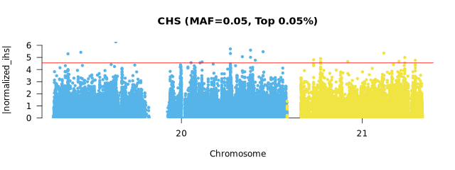
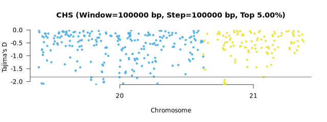
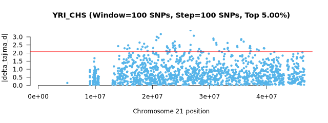
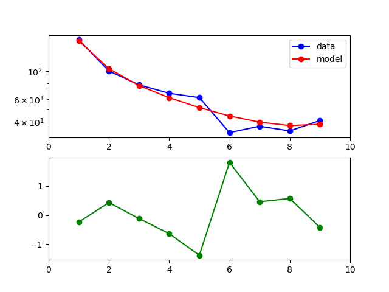
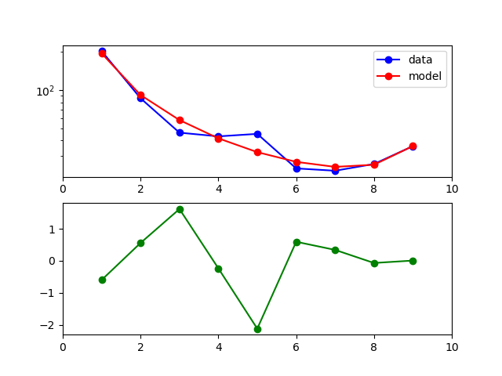
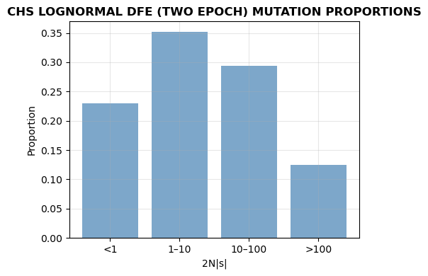

# Output

## Overview

`selscape` organizes results by analysis type and population:
```
results/
├── positive_selection/
│   ├── selscan/
│   │   ├── {species}/1pop/{ppl}/{method}_{maf}/     # Within-population (iHS, nSL)
│   │   └── {species}/2pop/{pair}/{method}_{maf}/    # Cross-population (XP-EHH, XP-nSL)
│   └── scikit-allel/
│       ├── {species}/1pop/{ppl}/{method}/{window}_{step}/   # Negative Tajima's D
│       └── {species}/2pop/{pair}/{method}/{window}_{step}/  # Delta Tajima's D
├── balancing_selection/
│   ├── betascan/{species}/{ppl}/m_{core_frq}/
│   └── scikit-allel/{species}/{method}/{ppl}/{window}_{step}/  # Positive Tajima's D
├── dadi/{species}/dfe/{ppl}/
│   ├── InferDM/        # Demographic models
│   ├── InferDFE/       # DFE inference
│   ├── StatDFE/        # Confidence intervals
│   └── plots/          # Fitted model visualizations
```

### Understanding File Paths
Throughout this documentation, file paths use the following wildcards:

- `{species}`: Species name (e.g., "Human")
- `{ppl}`: Population code (e.g., "YRI")
- `{pair}`: Population pair (e.g., "YRI_CHS")
- `{method}`: Selection statistic (e.g., "ihs", "windowed_tajima_d")
- `{maf}`: Minor allele frequency (e.g., "0.05")
- `{cutoff}`: Top proportion threshold (e.g., "0.0005")
- `{window}_{step}`: Window and step sizes
- `{ref_genome}`: Reference genome build (e.g., "hg38")
- `{demog}`: Demographic model (e.g., "two_epoch")
- `{dfe}`: DFE model (e.g., "lognormal")

## Positive Selection

### selscan

#### Within-Population Statistics (iHS, nSL)

**File path:**
```
results/positive_selection/selscan/{species}/1pop/{ppl}/{method}_{maf}/{ppl}.normalized.{method}.maf_{maf}.top_{cutoff}.outliers.scores
```

**Example output:**
```
SNP             CHR     BP      normalized_nsl  abs_normalized_nsl
21:35702539     21      35702539        -4.88331        4.88331
20:57138931     20      57138931        4.68161         4.68161
21:28603177     21      28603177        4.63644         4.63644
```

| Column | Description |
|--------|-------------|
| SNP | SNP identifier in format chromosome:position |
| CHR | Chromosome number |
| BP | Base pair position |
| normalized_{method} | Normalized selection statistic (iHS or nSL) |
| abs_normalized_{method} | Absolute value of normalized statistic |

Positive values indicate unusually long haplotypes around the derived allele, whereas negative values indicate unusually long haplotypes around the ancestral allele. Large absolute values may be consistent with a recent selective sweep.



#### Cross-Population Statistics (XP-EHH, XP-nSL)

**File path:**
```
results/positive_selection/selscan/{species}/2pop/{pair}/{method}_{maf}/{pair}.normalized.{method}.maf_{maf}.top_{cutoff}.outliers.scores
```

Same format as within-population statistics.

Positive values indicate a stronger extended-haplotype signal in the first population (e.g., YRI in YRI_CHS), and negative values indicate a stronger signal in the second population (e.g., CHS in YRI_CHS).

More information: [selscan](https://github.com/szpiech/selscan).

### scikit-allel

#### Windowed Tajima's D

**File path:**
```
results/positive_selection/scikit-allel/{species}/1pop/{ppl}/windowed_tajima/{window}_{step}/{ppl}.windowed_tajima..top_{cutoff}.outliers.scores
```
**Example output:**
```
SNP             CHR     BP      tajima_d        window_start    window_end      n_snps
20:61849        20      61849   -0.5400134      61849           161848          215
20:261849       20      261849  -0.2830888      261849          361848          400
```

| Column | Description |
|--------|-------------|
| SNP | SNP identifier in format chromosome:position |
| CHR | Chromosome number |
| BP | Base pair position (window center) |
| tajima_d | Tajima's D statistic |
| window_start | Window start position in base pairs |
| window_end | Window end position in base pairs |
| n_snps | Number of SNPs in window |

Negative values indicates an excess of rare variants, which can be consistent with a signature of positive selection, but may also be caused by demographic history (e.g., population expansion).



For all Tajima's D methods, each data point in the Manhattan plot represents the starting position (`window_start`) of a window.

#### Moving Tajima's D

**File path:**
```
results/positive_selection/scikit-allel/{species}/1pop/{ppl}/moving_tajima_d/{window}_{step}/{ppl}.moving_tajima_d.top_{cutoff}.outliers.scores
```

Similar format to windowed approach, but windows are defined by a fixed number of SNPs rather than base pairs.

| Column | Description |
|--------|-------------|
| SNP | SNP identifier in format chromosome:position |
| CHR | Chromosome number |
| BP | Base pair position (window center) |
| tajima_d | Tajima's D statistic |
| window_start | Window start position in base pairs |
| window_end | Window end position in base pairs |
| n_snps | Number of SNPs in window (constant) |


#### Delta Tajima's D (Cross-Population)

**File path:**
```
results/positive_selection/scikit-allel/{species}/2pop/{pair}/delta_moving_tajima_d/{window}_{step}/{pair}.delta_moving_tajima_d.top_{cutoff}.outliers.scores
```

**Example output:**
```
SNP             CHR     BP      delta_tajima_d  window_start    window_end      n_snps  abs_delta_tajima_d
21:26659162     21      26659162        3.41144         26659162        26674022        100     3.41144
21:21456001     21      21456001        3.17360         21456001        21473170        100     3.17360
21:27242333     21      27242333        -3.07313        27242333        27258823        100     3.07313
```

| Column | Description |
|--------|-------------|
| SNP | SNP identifier in format chromosome:position |
| CHR | Chromosome number |
| BP | Base pair position (window center) |
| delta_tajima_d | Difference in Tajima's D between populations |
| window_start | Window start position in base pairs |
| window_end | Window end position in base pairs |
| n_snps | Number of SNPs in window |
| abs_delta_tajima_d | Absolute value of delta Tajima's D |



Large positive or negative delta Tajima’s D values indicate strong differences in the allele frequency spectrum between populations, which may be consistent with differential selection but can also be explained by demographic history. Here, windows are defined by a fixed number of SNPs.

More information: [scikit-allel](https://scikit-allel.readthedocs.io/en/stable/index.html).

## Balancing Selection

### BetaScan

**File path:**
```
results/balancing_selection/betascan/{species}/{ppl}/m_{core_frq}/{ppl}.{ref_genome}.m_{core_frq}.b1.top_{cutoff}.outliers.scores
```

**Example output:**
```
SNP             CHR     BP      B1
20:1914695      20      1914695 41.939494
20:1914712      20      1914712 41.479453
20:1914729      20      1914729 40.555049
```

| Column | Description |
|--------|-------------|
| SNP | SNP identifier in format chromosome:position |
| CHR | Chromosome number |
| BP | Base pair position |
| B1 | Beta1 statistic for balancing selection |

Larger B1 values indicate stronger evidence for long-term balancing selection (i.e., a balanced polymorphism maintained over extended periods).


More information: [BetaScan](https://github.com/ksiewert/BetaScan/wiki).

### scikit-allel

#### Windowed Tajima's D

**File path:**
```
results/balancing_selection/scikit-allel/{species}/windowed_tajima_d/{ppl}/{window}_{step}/{ppl}.windowed_tajima_d.top_{cutoff}.outliers.scores
```
**Example output:**
```
SNP             CHR     BP      tajima_d        window_start    window_end      n_snps
20:61849        20      61849   -0.5400134      61849           161848          215
20:261849       20      261849  -0.2830888      261849          361848          400
```

| Column | Description |
|--------|-------------|
| SNP | SNP identifier in format chromosome:position |
| CHR | Chromosome number |
| BP | Base pair position (window center) |
| tajima_d | Tajima's D statistic |
| window_start | Window start position in base pairs |
| window_end | Window end position in base pairs |
| n_snps | Number of SNPs in window |

Positive values indicates an excess of intermediate-frequency variants; it can be consistent with balancing selection, but can also reflect demographic history.


#### Moving Tajima's D

**File path:**  
```
results/balancing_selection/scikit-allel/{species}/moving_tajima_d/{window}_{step}/{ppl}.moving_tajima_d.top_{cutoff}.outliers.scores
```

Similar format to windowed approach, but windows are defined by a fixed number of SNPs rather than base pairs.

| Column | Description |
|--------|-------------|
| SNP | SNP identifier in format chromosome:position |
| CHR | Chromosome number |
| BP | Base pair position (window center) |
| tajima_d | Tajima's D statistic |
| window_start | Window start position in base pairs |
| window_end | Window end position in base pairs |
| n_snps | Number of SNPs in window (constant) |


## Distribution of Fitness Effects
 
### dadi/dadi-cli

#### Demographic Model Inference

**File path:** `results/dadi/{species}/dfe/{ppl}/InferDM/{ppl}.{ref_genome}.{demog}.InferDM.bestfits`

**Example output:**
```
# Log(likelihood)       nu      T       misid   theta
-29.738235902874877     3.2402258068957983      0.13580062396208237     0.0010470465761291449   321.237660524018
-29.73823629293304      3.2417998728753408      0.13578140459967458     0.0010576355371547388   321.23238379628344
-29.73823658527745      3.237659010918116       0.13591524984020853     0.0010605026099018222   321.22253191565875
```

| Column | Description |
|--------|-------------|
| Log(likelihood) | Log-likelihood of the model fit (higher is better) |
| nu | Ratio of current population size to ancestral population size |
| T | Time since population size change, measured in 2Ne generations |
| misid | Proportion of misidentified ancestral states |
| theta | Population-scaled mutation rate (4Neμ) |

#### Demographic Model Fit

**File path:** `results/dadi/{species}/dfe/{ppl}/plots/{ppl}.{ref_genome}.{demog}.fitted.png`



The plot shows the observed frequency spectrum (data) compared to the model-predicted spectrum.

#### Distribution of Fitness Effects

**File path:** `results/dadi/{species}/dfe/{ppl}/InferDFE/{ppl}.{ref_genome}.{demog}.{dfe}.InferDFE.bestfits`

**Example output:**
```
# Log(likelihood)       log_mu  log_sigma       misid   theta
-28.737041385073574     2.5282728150148785      4.591179583286655       0.039371652920637594    742.0589958104816
-28.73804138508753      2.5282735377291865      4.591183662610013       0.0393715391668421      742.0589958104816
-28.737041388380618     2.5283038170363823      4.5912804442420105      0.039370931031321235    742.0589958104816
```

| Column | Description |
|--------|-------------|
| Log(likelihood) | Log-likelihood of the DFE model fit (higher is better) |
| log_mu | Mean of log-normal distribution of selection coefficients |
| log_sigma | Standard deviation of log-normal distribution of selection coefficients |
| misid | Proportion of misidentified ancestral states |
| theta | Population-scaled mutation rate (4Neμ) |


#### DFE Model Fit Plot

**File path:** `results/dadi/{species}/dfe/{ppl}/plots/{ppl}.{ref_genome}.{demog}.{dfe}.fitted.png`



The plot shows the observed vs. model-predicted frequency spectrum for nonsynonymous mutations.

#### Mutation Proportion Plot

**File path:** `results/dadi/{species}/dfe/{ppl}/plots/{ppl}.{ref_genome}.{demog}.{dfe}.fitted.mut.prop.png`



The mutation proportion plot shows the proportions of deleterious mutations grouped by the population-scaled selection coefficient (2N|s|): nearly neutral mutations (< 1), weakly deleterious mutations (1–10), moderately deleterious mutations (10–100), and strongly deleterious mutations (> 100).

#### Confidence Intervals

**File path:**  `results/dadi/{species}/dfe/{ppl}/StatDFE/{ppl}.{ref_genome}.{demog}.{dfe}.godambe.ci`

**Example output:**
```
Estimated 95% uncerts (theta adj), with step size 0.1): [2.45625971 3.17513531 0.11405905]
Lower bounds of 95% confidence interval : [-0.65471712 -0.74208004 -0.0046111 ]
Upper bounds of 95% confidence interval : [4.2578023  5.60819059 0.22350701]

Estimated 95% uncerts (theta adj), with step size 0.01): [2.19800876 2.55236006 0.10687941]
Lower bounds of 95% confidence interval : [-0.39646617 -0.11930478  0.00256854]
Upper bounds of 95% confidence interval : [3.99955135 4.98541534 0.21632737]

Estimated 95% uncerts (theta adj), with step size 0.001): [2.19575422 2.54701563 0.10682199]
Lower bounds of 95% confidence interval : [-0.39421163 -0.11396035  0.00262596]
Upper bounds of 95% confidence interval : [3.99729681 4.98007091 0.21626994]
```

Godambe-based 95% confidence intervals for all DFE parameters.

More information: [dadi](https://dadi.readthedocs.io/en/latest/) and [dadi-cli](https://dadi-cli.readthedocs.io/en/latest/).

## Functional Annotation

Gene and functional annotation of outliers:

### ANNOVAR Annotated Outliers

All outliers are annotated with gene information:

**File path:** `{analysis_path}/{file_prefix}.annotated.outliers`

**Example output:**
```
Chr     Start   End     Ref     Alt     Func.refGene    Gene.refGene    ExonicFunc.refGene      AAChange.refGene
20      14150039        14150039        C       A       intronic        MACROD2 .       .
20      17148100        17148100        C       A       intergenic      OTOR;PCSK2      .       .
20      23595497        23595497        G       A       intergenic      CST9L;CST9      .       .
```

| Column | Description |
|--------|-------------|
| Chr | Chromosome number |
| Start | Variant start position in base pairs |
| End | Variant end position in base pairs |
| Ref | Reference allele |
| Alt | Alternative allele |
| Func.refGene | Functional region (exonic, intronic, intergenic, UTR, etc.) |
| Gene.refGene | Gene symbol(s) |
| ExonicFunc.refGene | Exonic function (synonymous, nonsynonymous, stopgain, stoploss, etc.) |
| AAChange.refGene | Amino acid change for coding variants |

### Outlier Gene Lists

**File path:** `{analysis_path}/{file_prefix}.outlier.genes`

**Example output:**
```
Gene
HLCS
MACROD2
PCSK2
UQCC1
```

Simple list of unique genes extracted from annotated outliers.

More information: [ANNOVAR](https://annovar.openbioinformatics.org/en/latest/).

## GO Enrichment Analysis

Statistical testing for GO enrichment in outlier genes:

### Gowinda Enrichment Results

**File path:**  `{analysis_path}/{file_prefix}.gowinda.enrichment.tsv`

**Example output:**
```
GO_ID       avg_genes_sim   genes_found     p_value         p_adjusted      genes_uniq      genes_max       genes_total     description                     gene_list
GO:0034551  0.008           1               0.0082240000    1.0000000000    1               1               14              mitochondrial complex III       uqcc1
GO:0031410  0.270           2               0.0247750000    1.0000000000    2               37              1017            cytoplasmic vesicle             uqcc1,pcsk2
GO:0004077  0.030           1               0.0297130000    1.0000000000    1               1               1               biotin ligase activity          hlcs
```

| Column | Description |
|--------|-------------|
| GO_ID | Gene Ontology term identifier |
| avg_genes_sim | Average number of genes in simulations |
| genes_found | Number of outlier genes found in this GO term |
| p_value | Uncorrected p-value from simulation |
| p_adjusted | FDR-corrected p-value |
| genes_uniq | Number of unique genes in this GO term |
| genes_max | Maximum possible genes for this term |
| genes_total | Total genes in background set |
| description | GO term description |
| gene_list | Comma-separated list of outlier genes |

### Enrichment Visualization

**File path:**  `{analysis_path}/{file_prefix}.gowinda.enrichment.png`


The enrichment plot shows top 20 GO terms, sorted by their significance (FDR adjusted p-value) and then by the number of genes found. Bars are colored based on significance: red for highly significant enrichment (< 0.001), purple for significant enrichment (< 0.01), blue for moderately significant enrichment (< 0.05), and gray for non-significant results (≥ 0.05).

More information: [Gowinda Tutorial](https://sourceforge.net/p/gowinda/wiki/Tutorial).

## Interactive HTML Reports

All methods generate interactive HTML tables with search, sort, and export functionality:

- **Gene lists**: `{analysis_path}/{file_prefix}.outlier.genes.html`
- **Enrichment results**: `{analysis_path}/{file_prefix}.gowinda.enrichment.html`
- **Best-fit parameters**:

  - `results/dadi/{species}/dfe/{ppl}/html/{ppl}.{ref_genome}.{demog}.InferDM.top10.bestfits.html`
  - `results/dadi/{species}/dfe/{ppl}/html/{ppl}.{ref_genome}.{demog}.{dfe}.InferDFE.top10.bestfits.html`
  - `results/dadi/{species}/dfe/{ppl}/html/{ppl}.{ref_genome}.{demog}.{dfe}.godambe.ci.html`
