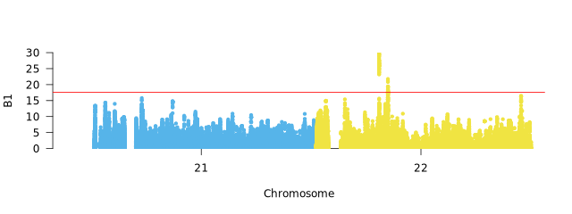
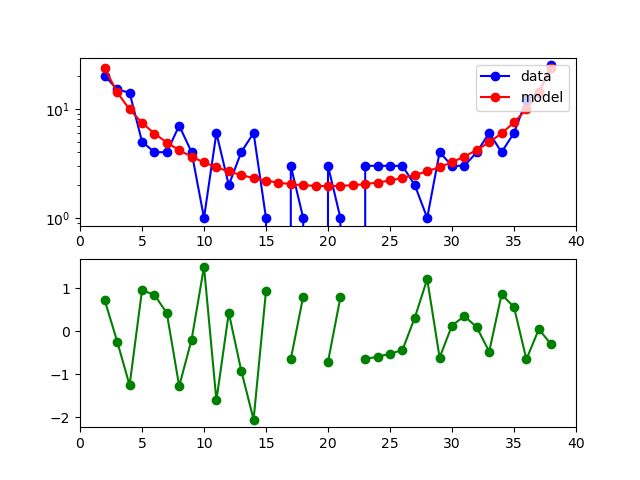
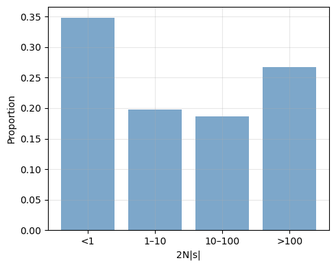
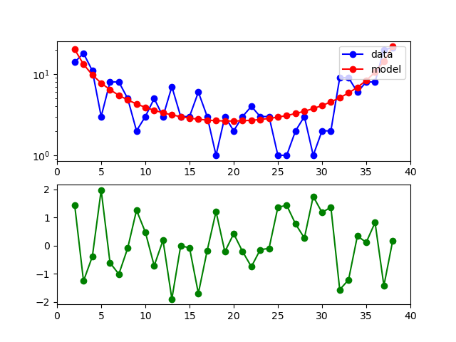

# Output

## Betascan Results (Balancing Selection)
Results are saved in `results/plots/betascan/Human/YRI/m_0.15/YRI.b1.top.0.0005.candidates.scores`.
```
SNP     CHR     BP      B1
22:22350476     22      22350476        29.950265
22:22350435     22      22350435        29.8842
22:22350418     22      22350418        29.332644
22:22350419     22      22350419        29.332644
22:22350497     22      22350497        29.327195
```
|   column             |Description                        |
|----------------|-------------------------------|
|SNP|SNP identifier in format chromosome:position          |
|CHR       |Chromosome number            |
|BP          |Base pair position            |
|B1         |Beta1 statistic for balancing selection|


Higher B1 values suggests stronger evidence for balancing selection of loci where multiple alleles are maintained in the population over long periods.



## Selscan Results (Positive Selection)
Results are saved in `results/plots/selscan/Human/1pop/YRI/nsl_0.05/YRI.normalized.nsl.top.0.0005.candidates.scores`.
```
SNP     CHR     BP      normalized_nsl  abs_normalized_nsl
21:27635622     21      27635622        4.98329 4.98329
22:19879946     22      19879946        4.5454  4.5454
21:29707889     21      29707889        4.54516 4.54516
21:27617315     21      27617315        4.37302 4.37302
21:27642578     21      27642578        4.33443 4.33443
```

|   column             |Description                        |
|----------------|-------------------------------|
|SNP|SNP identifier in format chromosome:position          |
|CHR       |Chromosome number            |
|BP          |Base pair position            |
|normalized_{method}          |Normalized selection statistic (iHS, nSL, XP-EHH, XP-nSL)|

High scores indicate recent positive selection where beneficial alleles rapidly increased in frequency. With iHS, nSL statistics, positive values means selection favoring the derived allele, while negative values indicates that selection favors the  ancestral allele. With cross selection statistisc (XP-EHH, XP-nSL), positive values show selection in the population 1 (first population listed). Negative values suggest selection in population 2 (second population listed)


## Selection Candidates Annotation


**Selscan Example**

Results are stored in `results/plots/selscan/Human/1pop/YRI/nsl_0.05/YRI.normalized.nsl.top.0.0005.annotated.candidates`.
```
Chr     Start   End     Ref     Alt     Func.refGene    Gene.refGene    GeneDetail.refGene      ExonicFunc.refGene      AAChange.refGene        normalized_nsl
21      19259240        19259240        A       C       intergenic      MIR548XHG;LINC01683     dist=499428;dist=634039 .       .       3.95068
21      19261015        19261015        A       G       intergenic      MIR548XHG;LINC01683     dist=501203;dist=632264 .       .       4.01447
21      19267995        19267995        T       C       intergenic      MIR548XHG;LINC01683     dist=508183;dist=625284 .       .       4.01979
21      19269299        19269299        T       G       intergenic      MIR548XHG;LINC01683     dist=509487;dist=623980 .       .       4.11579
21      26270854        26270854        G       T       intergenic      APP;CYYR1-AS1   dist=99726;dist=122781  .       .       4.05708

```
Betascan candidate results have the same format, except the last column is replaced with B1 score.


|   column             |Description                        |
|----------------|-------------------------------|
|Chr|Chromosome          |
|Start      |Start Position of SNP window           |
|End         |End position of SNP window         |
|Ref          |Reference Allele|
|Alt|Alternative Allele          |
|Func.refGene      |Functional annotation (exonic, intronic, etc.)         |
|Gene.refGene        |Gene symbol           |
|ExonicFunc.refGene          |Exonic function (synonymous, nonsynonymous, etc.)|
|AAChange.refGene         |Amino acid change|
|score         |Selection statistic value|


## Dadi-cli Results (DFE)

**Distribution of Fitness**
Results are stored in  `results/dadi/Human/dfe/YRI/InferDFE/YRI.two_epoch.lognormal.InferDFE.bestfits`.
```
# Log(likelihood)       log_mu  log_sigma       misid   theta
-73.41934644376727      1.7742376119335284      4.559753870852618       0.5015783989621982      109.1154407955334
-73.41934644498568      1.7742354714850945      4.559733176638907       0.5015796658833618      109.1154407955334
-73.41934644574094      1.7741912224433796      4.559556286035392       0.5015732900807969      109.1154407955334
-73.41934644796211      1.7742737842199496      4.559849034026097       0.501578380722794       109.1154407955334
-73.4193464479745       1.7742196698650896      4.559773495395818       0.5015731621280807      109.1154407955334

```
|   column             |Description                        |
|----------------|-------------------------------|
|Log(likelihood)|mathematical measure how well model fits data          |
|log_mu      |Parameter describing the center of the lognormal distribution of selection coefficients         |
|log_sigma        | Parameter describing the spread of the lognormal distribution         |
|misid         |Proportion of misidentified ancestral states in the data|
|theta|Population-scaled mutation rate (4Nₑμ)         |





**Demographic Model**

Results are stored in  `results/dadi/Human/dfe/YRI/InferDM/YRI.two_epoch.InferDM.bestfits`.
```
# Log(likelihood)       nu      T       misid   theta
-79.60606341246546      1.857877325620087       0.89386482979015        0.5221338952316524      47.23612155650797
-79.60606342525003      1.8577744024737592      0.8936338130145334      0.5221316550112977      47.23939385737876
-79.6060634334366       1.8581105896989272      0.8943160610443462      0.5221359639465036      47.22936217589583
-79.60606343558128      1.8577712185300292      0.893591479798604       0.5221396169909492      47.23981367543949
-79.60606345017017      1.8581192423842108      0.8944501201199337      0.5221237715138266      47.228050635727726
```
|   column             |Description                        |
|----------------|-------------------------------|
|Log(likelihood)|mathematical measure how well model fits data          |
|nu      |ratio of current population size to ancestral size         |
|T (time)         |time since population size changed, meassured in 2N generation        |
|misid          |error rate of data, accounting for misidentified ancestral alleles or seq error|
|theta|population scaled mutation rate  





##  Gowinda Enrichment Results

Results are saved in `results/functional_analysis_gowinda/Human/1pop/YRI/nsl_0.05/YRI.nsl_0.05.top.0.0005.gowinda.enrichment.tsv`

```
GO:0006979	0.072	2	0.0015570000	0.1680687353	2	7	161	involved_in response to oxidative stress	txnrd2,comt
GO:0042415	0.007	1	0.0066270000	0.1680687353	1	1	10	involved_in norepinephrine metabolic process	comt
GO:0042417	0.007	1	0.0066270000	0.1680687353	1	1	18	involved_in dopamine metabolic process	comt
GO:0002001	0.007	1	0.0066270000	0.1680687353	1	1	4	acts_upstream_of_or_within renin secretion into blood stream	comt
GO:0048243	0.007	1	0.0066270000	0.1680687353	1	1	1	acts_upstream_of_or_within norepinephrine secretion	comt
```
|   column             |Description                        |
|----------------|-------------------------------|
|GO_ID|Gene Ontology term         |
|avg_genes_sim       |Average genes in simulations            |
|genes_found         |Genes found in candidates           |
|p_value         |Uncorrected p-value|
|p_adjusted|FDR-corrected p-value          |
|genes_uniq       |Unique genes in term         |
|genes_max          |Maximum genes possible            |
|genes_total         |Total genes in background|
|description       |GO term description        |
|gene_list        |Comma-separated candidate genes  


More information about gowinda can be found [here](https://sourceforge.net/p/gowinda/wiki/Tutorial).
